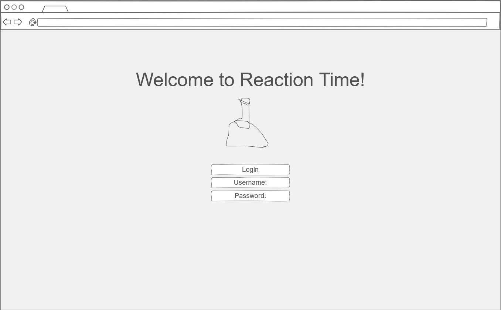
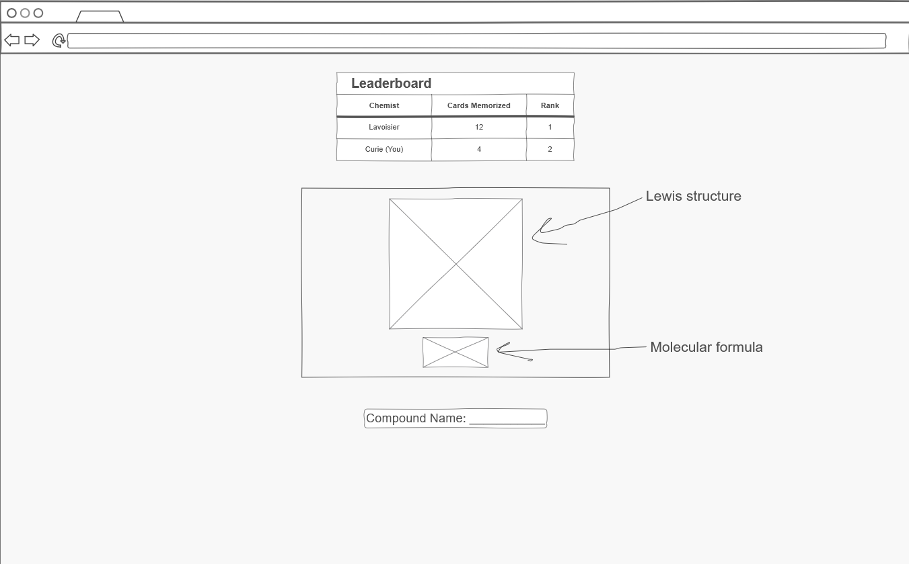

# Reaction Time

[My Notes](notes.md)

_Reaction Time_ is a real-time, competitive study tool designed to gamify the memorization of chemical nomenclature, polyatomic ions, and organic functional groups.

Users register for an account and access a "Study Deck," where they view chemical names (e.g., "Acetate" or "Benzene") and reveal the corresponding formula or structure. The application integrates with the PubChem API to dynamically fetch and render accurate molecular visualizations for each card.

The core technical differentiator is the real-time leaderboard. As users successfully "master" flashcards, their scores are updated in a persistent database and instantly broadcast via WebSockets to all connected users. This creates a live, updating leaderboard where students can watch their class ranking shift in real time, fostering a sense of urgency and competition.

## 🚀 Specification Deliverable

For this deliverable I did the following. I checked the box `[x]` and added a description for things I completed.

- [x] Proper use of Markdown
- [x] A concise and compelling elevator pitch
- [x] Description of key features
- [x] Description of how you will use each technology
- [x] One or more rough sketches of your application. Images must be embedded in this file using Markdown image references.

### Elevator pitch

Studying for chemistry is usually a lonely, static experience—you stare and sift through numerous compounds until, eventually, they are memorized. Knowing that competition drives engagement, _Reaction Time_ turns rote memorization into a live multiplayer race. It's a flashcard app where you aren't just studying against yourself; you're studying against the entire class in real time. Imagine sitting in the library, flipping through organic functional groups, and watching your name leap past your lab partner on the leaderboard because you studied five more cards than they did.

Using real chemical data and real-time socket connections, every point you score is felt by everyone else online—making the tedious part of chemistry feel like a live esport.

### Design

### Key features

The application consists of three distinct pages: main, quiz, and leaderboard.

- The **main page** allows users to log in and, upon authentication, start a quiz or view the leaderboard.
- The **quiz page** displays a rendered compound and its formula, with an input box for users to guess its name. A miniature leaderboard showing the top two or three players is also visible.
- The **leaderboard page** shows the current rankings of top "chemists" based on how many flashcards they have completed.

### Technologies

I am going to use the required technologies in the following ways.

- **HTML** - Provides the structural foundation for three pages: login/main, quiz (flashcard interface), and leaderboard.
- **CSS** - Styles the flashcard components, leaderboard rankings, and ensures responsive layout across devices.
- **React** - Manages UI components (flashcards, score displays), handles routing between pages, and maintains reactive state for quiz progress.
- **Service** - Backend endpoints for login, user scores and flashcard data, plus integration with the PubChem API to fetch molecular structures.
- **DB/Login** - Stores user credentials for authentication and persists player scores/progress for leaderboard rankings.
- **WebSocket** - Broadcasts real-time score updates to all connected users, enabling the live leaderboard experience.

## 🚀 AWS deliverable

For this deliverable I did the following. I checked the box `[x]` and added a description for things I completed.

- [x] **Server deployed and accessible with custom domain name** - [My server link](https://reactiontimes.click/).

## 🚀 HTML deliverable

For this deliverable I did the following. I checked the box `[x]` and added a description for things I completed.

- [x] **HTML pages** - Four pages: login (index.html), quiz, leaderboard, and about.
- [x] **Proper HTML element usage** - Uses BODY, HEADER, NAV, MAIN, FOOTER, SECTION, ASIDE, and TABLE elements appropriately.
- [x] **Links** - Navigation links between all four pages on every page, plus GitHub link in footer.
- [x] **Text** - Quiz prompts, leaderboard rankings, user stats, and about page description.
- [x] **3rd party API placeholder** - PubChem API placeholder for fetching molecular structure images.
- [x] **Images** - Lewis structure image displayed on the quiz page.
- [x] **Login placeholder** - Login form with email/password inputs and username display after login.
- [x] **DB data placeholder** - User scores, leaderboard table rankings, and personal stats sections.
- [x] **WebSocket placeholder** - Live "Chemists online" count, real-time mini-leaderboard, and connection status indicator.

## 🚀 CSS deliverable

For this deliverable I did the following. I checked the box `[x]` and added a description for things I completed.

- [x] **Visually appealing colors and layout. No overflowing elements.** - Applied a chemistry-themed dark color scheme with blues and greens. All elements properly contained with no overflow issues.
- [x] **Use of a CSS framework** - Integrated Bootstrap 5.3.2 for responsive grid, navbar, cards, tables, forms, and buttons across all pages.
- [x] **All visual elements styled using CSS** - Styled navigation, login forms, quiz interface, Lewis structure display, leaderboard table, score cards, and about page with consistent theming.
- [x] **Responsive to window resizing using flexbox and/or grid display** - Body uses flexbox for sticky footer. Bootstrap grid for responsive layouts. Media queries for mobile-friendly input groups and smaller screens.
- [x] **Use of a imported font** - Imported Google Fonts 'Poppins' with weights 400 and 600 for modern typography.
- [x] **Use of different types of selectors including element, class, ID, and pseudo selectors** - Element selectors (body, header, footer, table, h1), class selectors (.card, .navbar, .btn-primary), ID selectors (#quiz-container, #user-score, #mini-leaderboard), and pseudo selectors (:hover, :first-child, @keyframes animations).

## 🚀 React part 1: Routing deliverable

For this deliverable I did the following. I checked the box `[x]` and added a description for things I completed.

- [ ] **Bundled using Vite** - I did not complete this part of the deliverable.
- [ ] **Components** - I did not complete this part of the deliverable.
- [ ] **Router** - I did not complete this part of the deliverable.

## 🚀 React part 2: Reactivity deliverable

For this deliverable I did the following. I checked the box `[x]` and added a description for things I completed.

- [ ] **All functionality implemented or mocked out** - I did not complete this part of the deliverable.
- [ ] **Hooks** - I did not complete this part of the deliverable.

## 🚀 Service deliverable

For this deliverable I did the following. I checked the box `[x]` and added a description for things I completed.

- [ ] **Node.js/Express HTTP service** - I did not complete this part of the deliverable.
- [ ] **Static middleware for frontend** - I did not complete this part of the deliverable.
- [ ] **Calls to third party endpoints** - I did not complete this part of the deliverable.
- [ ] **Backend service endpoints** - I did not complete this part of the deliverable.
- [ ] **Frontend calls service endpoints** - I did not complete this part of the deliverable.
- [ ] **Supports registration, login, logout, and restricted endpoint** - I did not complete this part of the deliverable.

## 🚀 DB deliverable

For this deliverable I did the following. I checked the box `[x]` and added a description for things I completed.

- [ ] **Stores data in MongoDB** - I did not complete this part of the deliverable.
- [ ] **Stores credentials in MongoDB** - I did not complete this part of the deliverable.

## 🚀 WebSocket deliverable

For this deliverable I did the following. I checked the box `[x]` and added a description for things I completed.

- [ ] **Backend listens for WebSocket connection** - I did not complete this part of the deliverable.
- [ ] **Frontend makes WebSocket connection** - I did not complete this part of the deliverable.
- [ ] **Data sent over WebSocket connection** - I did not complete this part of the deliverable.
- [ ] **WebSocket data displayed** - I did not complete this part of the deliverable.
- [ ] **Application is fully functional** - I did not complete this part of the deliverable.
